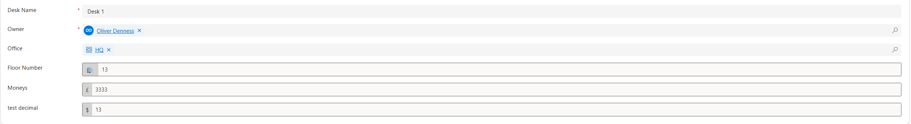

# OdennessDev Prefix/Suffix Text Field PCF Control

[](https://github.com/odenness/oden-prefixsuffix-pcf/releases/tag/v0.1.0-alpha)
[](https://powerplatform.microsoft.com/)
[](https://www.typescriptlang.org/)
[](https://github.com/odenness/oden-prefixsuffix-pcf/blob/main/LICENSE)

A customizable PowerApps Component Framework (PCF) control that enhances text input fields with prefix and suffix display capabilities. Ideal for currency fields, phone numbers, email addresses, and any text input requiring visual context without storing formatting in the database.



## Key Features

**Core Functionality**
- Prefix and suffix text display (not saved to database)
- Main text value storage (saved to database)
- Support for Text, Email, Phone, URL, Currency, Decimal, and Whole Number fields
- Customizable placeholder text
- Optional clear button functionality
- Regular expression pattern validation with custom error messages

**Visual Customization**
- Customizable colors (background, text, border) with Dynamics 365 native styling
- Configurable typography (font size, weight)
- Custom dimensions (width and height)
- 22 built-in Unicode icons plus custom symbol support
- Responsive design with automatic theme adaptation

**Accessibility & User Experience**
- Full keyboard navigation and tab order support
- Screen reader compatibility with proper ARIA labels
- High contrast mode support
- Clear visual feedback for focus and disabled states

## Supported Field Types

| Field Type | Description | Example Use Case |
|------------|-------------|------------------|
| Text | Single line text fields | Names, descriptions |
| Email | Email address fields | Contact information |
| Phone | Phone number fields | Business/personal phones |
| URL | Website URL fields | Company websites |
| Currency | Monetary value fields | Prices, salaries |
| Decimal | Decimal number fields | Measurements, percentages |
| Whole Number | Integer fields | Quantities, counts |

## Configuration Properties

| Property | Type | Required | Description |
|----------|------|----------|-------------|
| `textValue` | SingleLine.Text | Yes | The main text value saved to the database |
| `prefixText` | SingleLine.Text | No | Text displayed before the input field |
| `suffixText` | SingleLine.Text | No | Text displayed after the input field |
| `placeholderText` | SingleLine.Text | No | Placeholder text shown in the input field |
| `maxLength` | Whole.None | No | Maximum number of characters allowed |
| `isReadOnly` | TwoOptions | No | Make the text field read-only |
| `backgroundColor` | SingleLine.Text | No | Background color (hex value, e.g., `#f8f9fa`) |
| `textColor` | SingleLine.Text | No | Text color (hex value, e.g., `#323130`) |
| `borderColor` | SingleLine.Text | No | Border color (hex value, e.g., `#605e5c`) |
| `fontSize` | Whole.None | No | Font size in pixels |
| `fontWeight` | SingleLine.Text | No | Font weight (normal, bold, 600, etc.) |
| `controlWidth` | Whole.None | No | Width of the control in pixels |
| `controlHeight` | Whole.None | No | Height of the control in pixels |
| `prefixIcon` | SingleLine.Text | No | Icon name for prefix (see available icons) |
| `suffixIcon` | SingleLine.Text | No | Icon name for suffix (see available icons) |
| `showClearButton` | TwoOptions | No | Show a clear button to empty the text field |
| `validationPattern` | SingleLine.Text | No | Regular expression pattern for validation |
| `errorMessage` | SingleLine.Text | No | Custom error message for validation failures |

## Available Icons

The control includes 22 built-in Unicode icons:

| Icon Name | Symbol | Use Case |
|-----------|--------|----------|
| `Person` | 👤 | User fields, names |
| `Mail` | 📧 | Email addresses |
| `Phone` | 📞 | Phone numbers |
| `Building` | 🏢 | Company, organization |
| `CurrencySymbol` | 💲 | Currency fields |
| `Tag` | 🏷️ | Categories, labels |
| `Calendar` | 📅 | Dates, schedules |
| `Lock` | 🔒 | Security, passwords |
| `Search` | 🔍 | Search fields |
| `Edit` | ✏️ | Editable content |
| `Info` | ℹ️ | Information fields |
| `CheckMark` | ✓ | Validation, success |
| `Clear` | ✕ | Clear, delete |
| `Save` | 💾 | Save operations |
| `Upload` | ⬆️ | File uploads |
| `Settings` | ⚙️ | Configuration |
| `Home` | 🏠 | Home address |
| `Heart` | ❤️ | Favorites, likes |
| `Star` | ⭐ | Ratings, importance |
| `Warning` | ⚠️ | Warnings |
| `Error` | ❌ | Errors |
| `Success` | ✅ | Success states |

## Installation

1. Download the latest solution from [Releases](https://github.com/odenness/oden-prefixsuffix-pcf/releases/tag/v0.1.0-alpha)
2. Import into Power Platform:
   - Navigate to [PowerApps](https://make.powerapps.com)
   - Go to **Solutions** > **Import solution**
   - Upload the `.zip` file
   - Follow the import wizard
3. Add to your form:
   - Edit your model-driven app form
   - Select a text field
   - Go to **Properties** > **Controls**
   - Click **Add control**
   - Select **OdennessDev Prefix/Suffix Text Field**
   - Configure properties as needed

## Development Setup

### Prerequisites
- PowerApps CLI - [Install Guide](https://docs.microsoft.com/powerapps/developer/component-framework/pac-cli)
- Node.js (LTS version) - [Download](https://nodejs.org/)
- Visual Studio Code (recommended) - [Download](https://code.visualstudio.com/)

### Building the Control

```bash
# Clone the repository
git clone https://github.com/odenness/oden-prefixsuffix-pcf.git
cd oden-prefixsuffix-pcf

# Install dependencies
npm install

# Build the control
npm run build

# Test the control locally
npm start
```

### Solution Deployment

```bash
# Navigate to solution folder
cd solution

# Build solution package
msbuild /p:configuration=Release

# The generated .zip file will be in bin/Release folder
```

## Usage Examples

### Currency Field with Symbol
```yaml
Field Type: Currency
Prefix Text: "$"
Text Value: (bound to currency field)
Placeholder: "0.00"
```
**Result**: `$1,234.56` (only "1,234.56" is saved to database)

### Email Field with Validation
```yaml
Field Type: Email  
Prefix Icon: "Mail"
Placeholder Text: "Enter your email address"
Validation Pattern: "^[^\s@]+@[^\s@]+\.[^\s@]+$"
Error Message: "Please enter a valid email address"
```

### Phone Number with Formatting
```yaml
Field Type: Phone
Prefix Text: "+1 ("
Suffix Text: ")"
Placeholder Text: "555-1234"
Validation Pattern: "\d{3}-\d{4}"
Max Length: 8
```
**Result**: `+1 (555) 1234` (only "555-1234" is saved)

## Customization

### Color Schemes

**Professional Theme**
```yaml
Background Color: "#ffffff"
Text Color: "#323130"  
Border Color: "#d3d3d3"
Font Size: 14
Font Weight: "400"
```

**Dark Theme**
```yaml
Background Color: "#1f1f1f"
Text Color: "#ffffff"
Border Color: "#404040"
Font Size: 14
Font Weight: "400"
```

### Validation Patterns

```javascript
// Email validation
"^[^\s@]+@[^\s@]+\.[^\s@]+$"

// Phone number (US format)
"^\(\d{3}\)\s\d{3}-\d{4}$"

// Credit card (basic format)
"^\d{4}\s\d{4}\s\d{4}\s\d{4}$"

// ZIP code (US)
"^\d{5}(-\d{4})?$"

// URL validation
"^https?:\/\/.+\..+"
```

## Browser Compatibility

| Browser | Version | Support |
|---------|---------|---------|
| Microsoft Edge | Chromium-based | Full |
| Google Chrome | 80+ | Full |
| Mozilla Firefox | 75+ | Full |
| Safari | 13+ | Full |

## API Reference

### Methods
- `init()` - Initialize the control
- `updateView()` - Update control properties and data
- `getOutputs()` - Return current value to Power Platform
- `destroy()` - Clean up resources

### Events
- `onInputChange` - Triggered when text value changes
- `onInputFocus` - Triggered when field receives focus
- `onInputBlur` - Triggered when field loses focus
- `onClearClick` - Triggered when clear button is clicked

## Contributing

We welcome contributions! Here's how to get started:

1. Fork the repository
2. Create a feature branch (`git checkout -b feature/amazing-feature`)
3. Commit your changes (`git commit -m 'Add amazing feature'`)
4. Push to the branch (`git push origin feature/amazing-feature`)
5. Open a Pull Request

### Development Guidelines
- Follow TypeScript best practices
- Add tests for new features
- Update documentation
- Maintain backward compatibility

## Support

- **Report Issues**: [GitHub Issues](https://github.com/odenness/oden-prefixsuffix-pcf/issues)
- **Discussions**: [GitHub Discussions](https://github.com/odenness/oden-prefixsuffix-pcf/discussions)
- **Email**: [support@odennessdev.com](mailto:support@odennessdev.com)

## Changelog

### Version 0.1.0-alpha (Current)
- Initial alpha release
- Multi-field type support (Text, Email, Phone, URL, Currency, Decimal, Whole Number)
- 22 built-in Unicode icons
- Dynamics 365 native styling
- Enhanced accessibility features
- Dark theme support
- TypeScript implementation
- Performance optimizations

### Version 1.0.0 (Planned)
- Stable release with comprehensive testing
- Complete documentation
- Video tutorials
- Full test coverage

[View Full Changelog](https://github.com/odenness/oden-prefixsuffix-pcf/releases/tag/v0.1.0-alpha)

## License

This project is licensed under the MIT License - see the [LICENSE](LICENSE) file for details.

## Acknowledgments

- Built with [PowerApps Component Framework](https://docs.microsoft.com/powerapps/developer/component-framework/)
- Design inspired by [Fluent UI Design System](https://developer.microsoft.com/fluentui)
- Developed with TypeScript, Webpack, and ESLint

---

**Made by [OdennessDev](https://github.com/odenness)**

[Download](https://github.com/odenness/oden-prefixsuffix-pcf/releases/tag/v0.1.0-alpha) • [Report Bug](https://github.com/odenness/oden-prefixsuffix-pcf/issues) • [Request Feature](https://github.com/odenness/oden-prefixsuffix-pcf/issues/new)